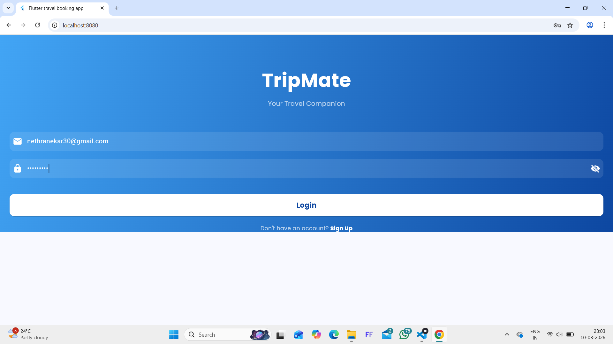
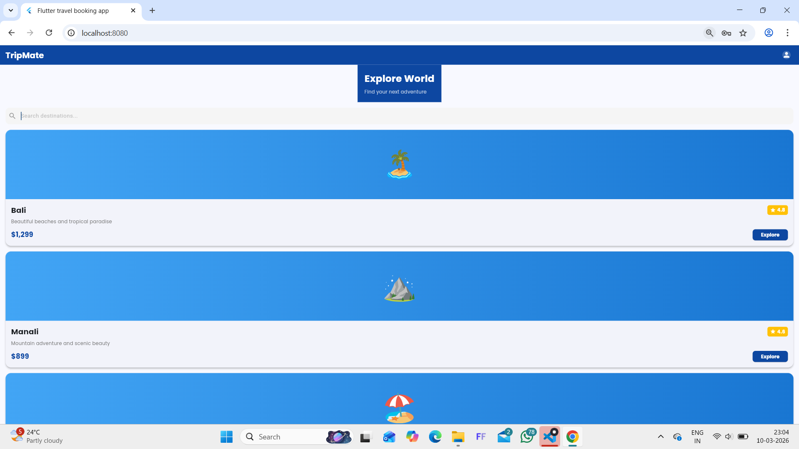
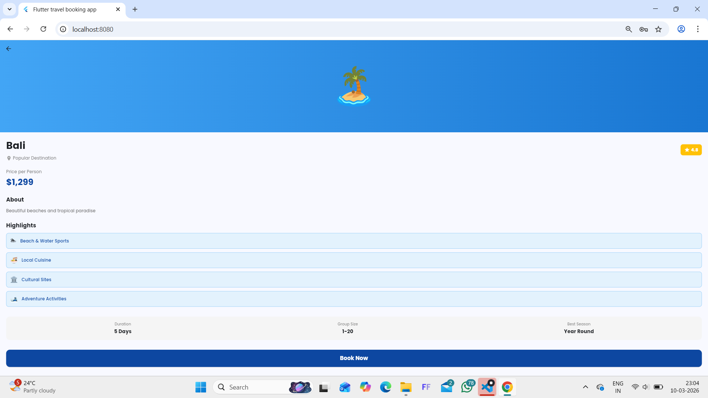
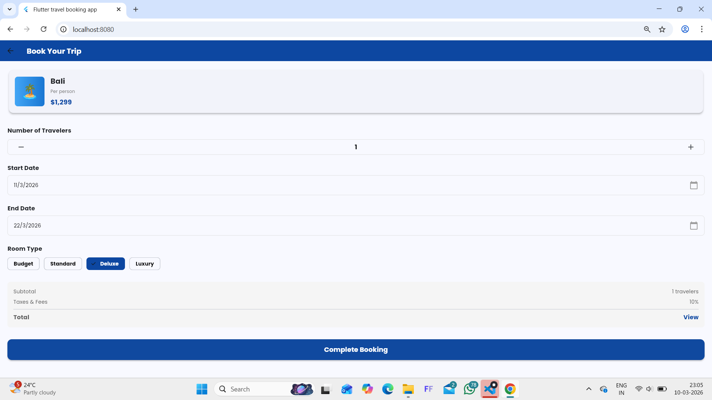
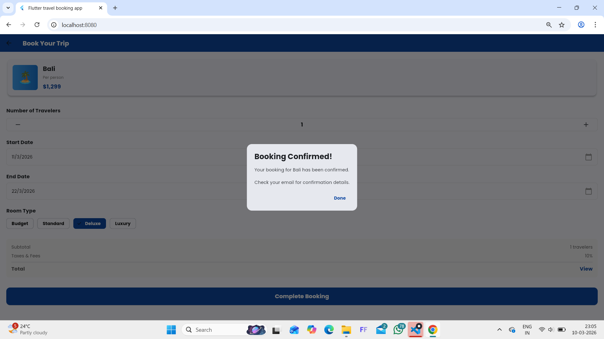

# 🧳 TripMate - Travel Booking App

A beautiful and intuitive travel booking application built with Flutter. TripMate makes it easy to explore destinations, check travel details, and complete bookings with just a few taps.

**Status:** ✅ Active Development  
**Platform:** iOS, Android, Web, Windows, macOS, Linux


## 🎯 Features

- ✈️ **Destination Explorer** - Browse beautiful travel destinations
- 📋 **Travel Details** - View comprehensive information about each destination
- 📝 **Booking Form** - Simple and intuitive booking interface
- 📅 **Smart Date Picker** - Easy date selection for travel dates
- 👥 **Traveler Counter** - Add/remove travelers with one tap
- 🏨 **Room Selection** - Choose from various room types
- ✅ **Booking Confirmation** - Beautiful confirmation popup for successful bookings
- 🔐 **User Authentication** - Secure login system

  
## 📱 Screenshots

### Login Screen


### Home Page
 

### Destination Details
 

### Booking Form
 

### Room Selection
 

### Confirmation
 


## 🛠️ Tech Stack

| Technology | Purpose |
|:---:|:---|
| **Flutter 3.x** | Cross-platform mobile framework |
| **Dart 3.x** | Programming language |
| **Material 3 Design** | Modern UI components |
| **Google Fonts** | Beautiful typography |
| **Carousel Slider** | Image carousel functionality |


## 📋 Prerequisites

Before you begin, ensure you have the following installed:

- **Flutter SDK** - [Download here](https://flutter.dev/docs/get-started/install)
- **Dart SDK** - Included with Flutter
- **Git** - [Download here](https://git-scm.com/)
- **Android Studio** or **VS Code** - (Optional but recommended)

### Verify Installation:
```bash
flutter --version
dart --version
```


## 🚀 Getting Started

### 1️⃣ Clone the Repository

```bash
git clone https://github.com/YOUR-USERNAME/tripmate-app.git
cd tripmate-app
```

### 2️⃣ Install Dependencies

```bash
flutter pub get
```

### 3️⃣ Run the App

#### On Emulator/Physical Device:
```bash
flutter run
```

#### On Specific Platform:
```bash
# Android
flutter run -d android

# iOS (macOS only)
flutter run -d ios

# Web
flutter run -d chrome

# Windows (Windows only)
flutter run -d windows

# macOS (macOS only)
flutter run -d macos
```

---

## 📁 Project Structure

```
lib/
├── main.dart                 # App entry point
├── screens/
│   ├── login_page.dart      # User authentication screen
│   ├── home_page.dart       # Home/destination list screen
│   ├── destination_page.dart # Destination details screen
│   └── booking_page.dart    # Booking form screen
└── widgets/                  # Reusable UI components
    └── (custom widgets here)

android/                       # Android native code
ios/                          # iOS native code
web/                          # Web app files
windows/                      # Windows app files
macos/                        # macOS app files
linux/                        # Linux app files
```

---

## 📦 Dependencies

- **flutter** - Core Flutter framework
- **cupertino_icons** - iOS-style icons
- **google_fonts** - Typography library
- **carousel_slider** - Image carousel widget

View all dependencies in [pubspec.yaml](pubspec.yaml)

---

## 🎯 How to Use

### 1. Launch the App
- Open the login screen
- Navigate through the app (supports skipping login for demo)

### 2. Explore Destinations
- Browse available travel destinations
- Tap on a destination to view details

### 3. Book a Trip
- Fill in your booking details
- Select travel dates
- Choose number of travelers
- Select room type
- Confirm your booking

### 4. View Confirmation
- See booking confirmation message
- Get booking details popup

---

## 🔧 Development

### Build APK (Android)
```bash
flutter build apk --release
```

### Build iOS App
```bash
flutter build ios --release
```

### Clean Build (if you face issues)
```bash
flutter clean
flutter pub get
flutter run
```


## 🐛 Troubleshooting

| Issue | Solution |
|:---:|:---|
| Build fails | Run `flutter clean` then `flutter pub get` |
| Dependencies error | Update Flutter: `flutter upgrade` |
| Android SDK issues | Check Android SDK version compatibility |
| iOS deployment issues | Update Xcode and CocoaPods |


## 👨‍💻 Contributing

Contributions are welcome! If you'd like to contribute to TripMate, please:

1. **Fork the repository**
2. **Create a feature branch** (`git checkout -b feature/AmazingFeature`)
3. **Commit your changes** (`git commit -m 'Add some AmazingFeature'`)
4. **Push to the branch** (`git push origin feature/AmazingFeature`)
5. **Open a Pull Request**

### Coding Guidelines:
- Follow Dart style guide
- Add comments for complex logic
- Update documentation accordingly
- Test your changes before submitting PR

## 🙏 Acknowledgments

- Flutter and Dart teams for the amazing frameworks
- Google Fonts for typography
- All contributors and testers
- The Flutter community for inspiration

## 📞 Support

Report issues on GitHub: https://github.com/nethranekar88-tech/flutter-travel-booking-app/issues

## 📄 License

MIT License - Feel free to use in your projects

---

**Built with ❤️ using Flutter & Firebase**

*Last Updated: March 2026*


